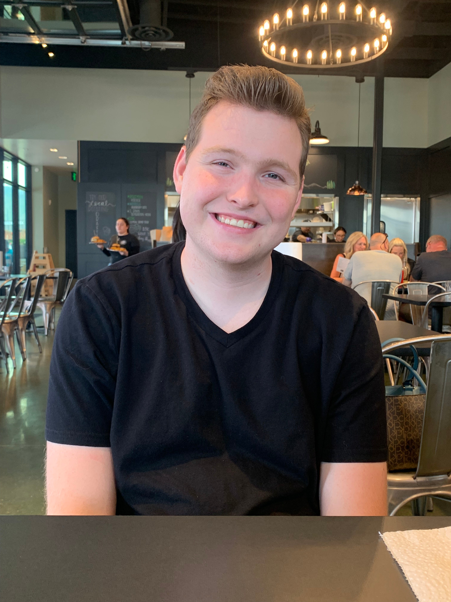

{width="200px" style="border-radius: 50%;"}

# About the Creator

> *"Science is not only a disciple of reason, but, also, one of romance and passion."*  
> — Stephen Hawking

My name is **Garrett Warr**, a biotechnology student at **Utah Valley University**, driven by a deep interest in **virology**, **pathology**, and how data can be used to combat public health challenges.

This website was developed as my **final project** for a Data Science course. It brings together influenza surveillance data, time-series modeling, and web-based visualization tools to help make flu trends more understandable, actionable, and accessible.

---

## Scientific Mission

I believe science should not just inform — it should **empower**. I’m passionate about using data to tell meaningful stories, illuminate health risks, and support real-world decision making. My goal is to work in a research lab or epidemiological setting where I can apply data science to emerging diseases and outbreak response.

---

## Academic Background

- **Biotechnology Major** — Utah Valley University  
- **Research Interests:**  
  - Viral evolution and host-pathogen dynamics  
  - RNA viruses and mechanisms of infection  
  - Infectious disease modeling and forecasting  
  - Bioinformatics and pathogen surveillance  
- **Career Aspirations:**  
  Pursue graduate research in virology, epidemiology, or data-driven health science.

---

## Technical Tools & Skills

- **Languages & Libraries:** R, Python, SQL, ggplot2, dplyr, Prophet, Shiny  
- **Technologies:** R Markdown, GitHub, Shiny dashboards, CDC API datasets  
- **Skills:**  
  - Data wrangling and cleaning  
  - Time series forecasting  
  - Interactive web development in R  
  - Visualization and communication of scientific data  

---

## Featured Projects

- **Flu Forecasting Dashboard** *(This Project)*  
  An interactive web tool visualizing over 20 years of influenza trends in the U.S., with state-level forecasting using Prophet models.  
  Includes ILI overlays, subtype filters, and predictive visualizations.

<!-- Add more: poster presentations, co-authored publications, or independent research in the future -->

---

## Download My CV

<a href="Garrett_Warr_CV_2025.docx" class="btn btn-primary" target="_blank">Download My CV</a>

---

<footer style="font-size: 0.8em; margin-top: 30px;">
Created by Garrett Warr | Data Science Final Project | Spring 2025
</footer>
