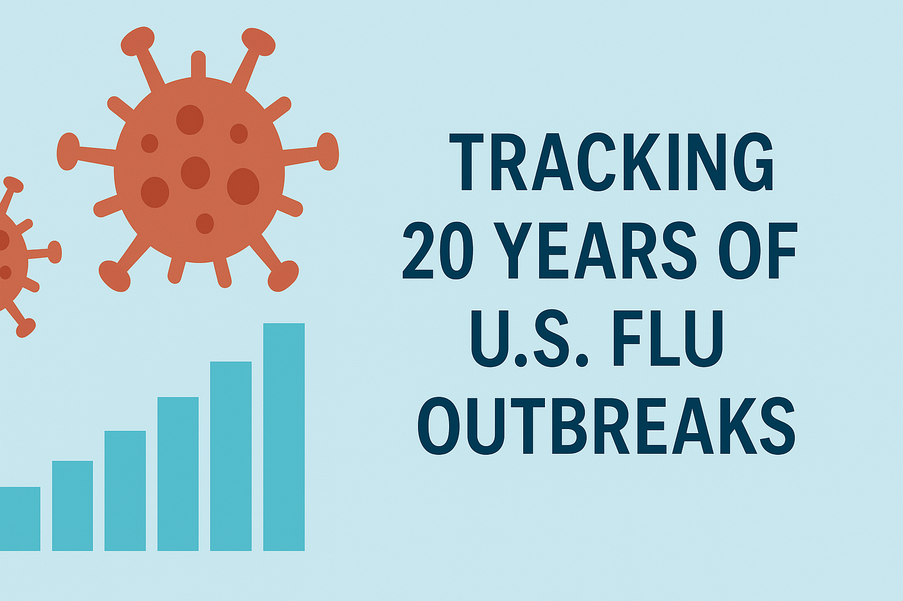

# U.S. Influenza Trends & Forecasting (2000–2023)

> *“Influenza doesn't just return each season—it evolves. Tracking it is not just science, it's strategy.”*

## Abstract

This project explores 23 years of U.S. influenza surveillance data (2000–2023) to identify trends in seasonal outbreaks, track the evolution of viral subtypes, and predict future flu activity using machine learning. Through time series analysis, geospatial visualization, and interactive forecasting tools, this capstone aims to inform public health strategy and improve epidemic preparedness.

The **U.S. Influenza Forecasting Hub** is an interactive data science platform developed as part of a capstone project at Utah Valley University. It presents over two decades of influenza data to support forecasting, visualization, and public health insights.

---

## Why This Matters

Influenza surveillance is crucial for:

- **Tracking Outbreaks** – Monitoring the rise and fall of seasonal flu cases  
- **Strain Prediction** – Anticipating dominant viral types like H1N1, H3N2, and B/Yamagata  
- **Public Health Strategy** – Informing vaccine formulation and emergency planning  
- **Awareness & Education** – Highlighting both seasonal and pandemic-level threats  

By learning from past flu seasons, we can better prepare for what’s ahead.

---

## Research Question

**How can historical flu trends and subtype patterns be used to forecast the emergence and severity of future influenza strains in the United States?**

This site explores that question by blending time series data, geospatial mapping, and machine learning-powered forecasting.

---

## Project Purpose

Built as a capstone for the **UVU Data Science program**, this website demonstrates:

- **Data Wrangling & Cleaning** – via tidyverse, lubridate  
- **Interactive Visualization** – using Plotly, Leaflet, Shiny  
- **Time Series Forecasting** – with Prophet  
- **Web Deployment** – through R Markdown and GitHub Pages  

The goal is to present flu surveillance data in an intuitive, accessible, and predictive format—bridging science, public health, and storytelling.

---

## What You’ll Find

- **Outbreak Insights** – Weekly case trends and viral subtype distributions
- **Heatmaps** – Geographic flu spread across U.S. regions  
- **Flu Forecasting** – Machine learning models predict next season’s behavior  
- **Raw Data** – Download the original dataset for your own analysis  
- **About the Author** – Learn about the creator and project story  

---

## Data Summary

- **Years Covered:** 2000–2023  
- **Tested Samples:** 10+ million  
- **Key Metrics:** ILI (Influenza-like Illness), % Positive, Strain Proportions  

---

## Limitations & Future Work

This analysis depends on CDC-reported surveillance data, which may underreport mild or untested flu cases. Future improvements could include:

- Incorporating hospitalization and mortality data  
- Real-time updates using live CDC APIs  
- Regional predictive models integrating local climate factors  

---

## Data Source

All data sourced from the **CDC FluView Interactive Portal**:  
[https://www.cdc.gov/flu/weekly/fluviewinteractive.htm](https://www.cdc.gov/flu/weekly/fluviewinteractive.htm)

---

  

<footer style="font-size: 0.9em; margin-top: 30px; border-top: 1px solid #ddd; padding-top: 10px; color: #555;">
  

    Created by Garrett Warr | <strong>UVU Data Science Capstone</strong> | Spring 2025  
  

  

    Data Source: CDC FluView | Educational Use Only  
  

  

    Last Updated: April 2025
  

</footer>

